# Customer Purchase Analysis: Project Overview
Customer data was analyzed to increase outreach and yield higher profits for an online grocery service. I merged data frames, generated new variables, and created data visualizations in Python. The results uncovered optimal advertising timeframes, top-selling products, and customer demographic profiles.

[Jupyter Notebook](https://github.com/ke177409/Customer-Purchase-Analysis/blob/main/Scripts/9.%20Final%20Results%20and%20Visuals.ipynb)

## Tools & Skills
Python Version: 3.11

Packages: pandas, NumPy, Matplotlib, seaborn, SciPy, pickle
* [Descriptive analysis](https://github.com/ke177409/Customer-Purchase-Analysis/blob/main/Scripts/1.%20Orders%2C%20Products%20Data%20Import%20%26%20Descriptive%20Analysis.ipynb).
* [Data wrangling and subsetting](https://github.com/ke177409/Customer-Purchase-Analysis/blob/main/Scripts/2.%20Data%20Wrangling%20%26%20Subsetting.ipynb).
* [Data consistency checks](https://github.com/ke177409/Customer-Purchase-Analysis/blob/main/Scripts/3.%20Data%20Consistency%20Checks.ipynb).
* [Merged data frames](https://github.com/ke177409/Customer-Purchase-Analysis/blob/main/Scripts/4.%20Combining%20%26%20Exporting%20Data.ipynb) using innner join.
* [Derived new variables](https://github.com/ke177409/Customer-Purchase-Analysis/blob/main/Scripts/5.%20Deriving%20New%20Variables.ipynb) employing if- and for-loops.
* Applied [grouping and aggregation](https://github.com/ke177409/Customer-Purchase-Analysis/blob/main/Scripts/6.%20Grouping%20Data%20%26%20Aggregating%20Variables.ipynb) techniques to organize and summarize data.
* Created [visualizations](https://github.com/ke177409/Customer-Purchase-Analysis/blob/main/Scripts/8.%20Visualizations.ipynb).

## Purpose & Context
This project was a part of CareerFoundry’s Data Immersion curriculum and was evaluated by my tutor and mentor.

## Data Cleaning & Transformation
* Columns containing irrelevant data were dropped from data frames.
* Columns "First Name" and "Surname" were removed to eliminate personally identifiable information.
* Renamed columns to achieve consistency across data frames.
* Dictionaries were created to assign appropriate data types.
* Missing values in the "product_name" column were removed, and duplicates were eliminated from the products dataset.
* Null values in the orders dataset were renamed as "N/A" to signify a user's initial order.
* Filtered data and created new columns using if- and for-loops in Python, which included:
 * "price_label" for product price ranges.
 * "busiest_day" of the week.
 * "busiest_period_of_day."
 * Grouping users into "Region" categories.
 * Excluding users with fewer than five orders.
 * Assigning a "Parent_Flag" to users with dependents.
* "transform()" and "loc()" functions were used to aggregate customer data and generate new variables, such as:
 * "max_order" to determine the maximum number of orders and assign customer loyalty status.
 * "average_price" column to calculate the average purchased item price and assign customer spending labels.
 * "median_days_prior_order" column to compute the median number of days since the previous order and assign customer frequency labels.
 * "Age_Profile" column to categorize users into distinct age groups based on specific criteria.
 
## Visualizations
Days of the week were represented as follows:

0 = Saturday

1 = Sunday

2 = Monday

3 = Tuesday

4 = Wednesday

5 = Thursday

6 = Friday

The histogram at the top left illustrates the total number of orders for all users on each day of the week. Saturday (day 0) and Sunday (day 1) are the busiest days, while Tuesday (day 3) and Wednesday (day 4) are the slowest.

The histogram at the top right depicts the total number of orders for each hour of the day, encompassing all users and all days of the week. 10:00am and 11:00am stood out as the most popular times among all users. A decline in order frequency was observed starting at 3:00pm, continuing until 4:00am the following day.

The accompanying line graph shows user spending levels for each hour of the day. The y-axis represents the average dollar amount for products purchased at certain hours of the day (x-axis). The graph highlighted peaks in spending during early morning hours, particularly around 2:00am to 3:00am, 4:00am to 5:00am, and 6:00am to 7:00am. Conversely, spending reached its lowest point from 7:00am to 10:00am.

A gradual increase in spending occurs just before 3:00pm, and a final spike in spending around 10:00pm.

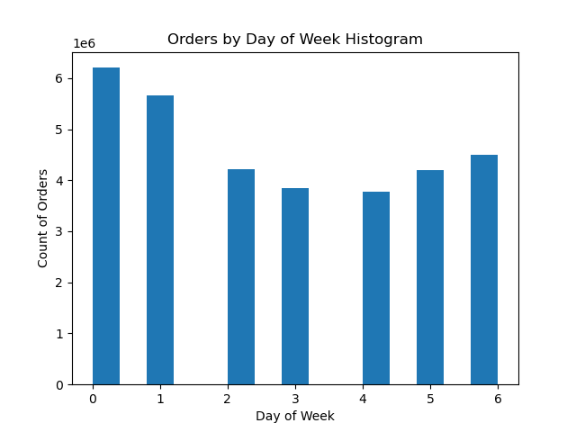

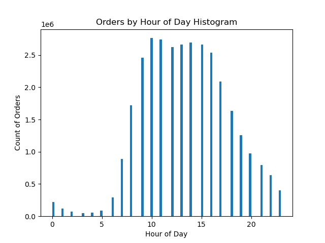

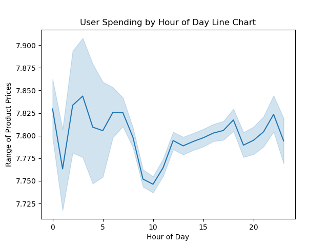

I measured the count of orders for each department while segmenting users based on several criteria, including the number of dependents, age group, loyalty status, region, and family status. The findings revealed that Produce, Dairy/Eggs, and Beverages consistently emerged as the most popular departments among all users, irrespective of user criteria.

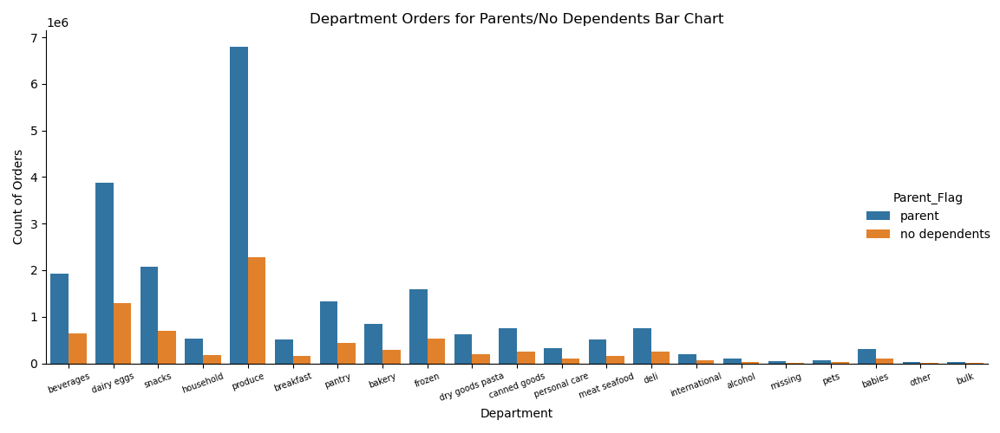

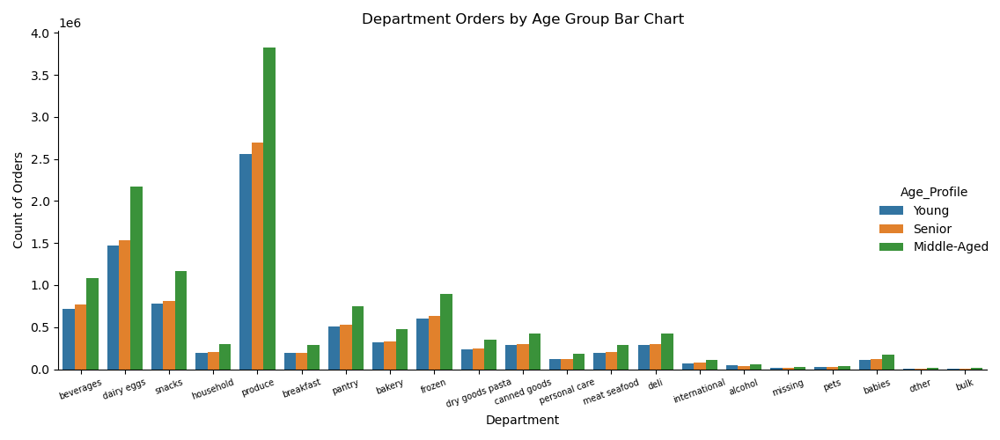

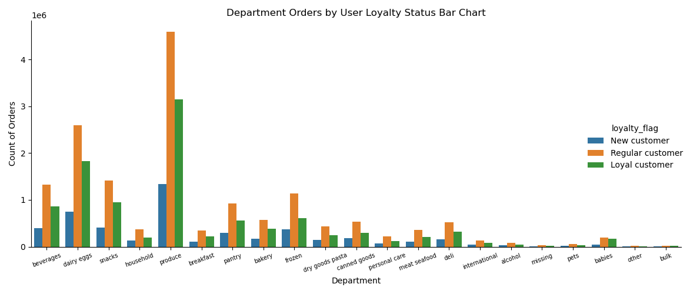

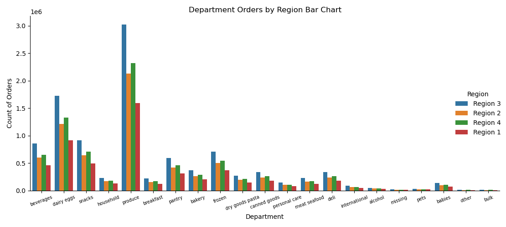

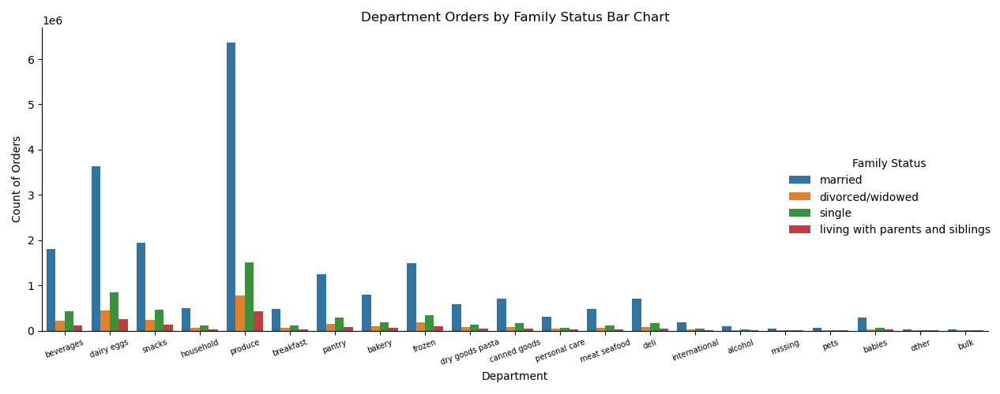

Customer regions were defined as follows: 

**Region 1**: Maine, New Hampshire, Vermont, Massachusetts, Rhode Island, Connecticut, New York, Pennsylvania, New Jersey

**Region 2**: Wisconsin, Michigan, Illinois, Indiana, Ohio, North Dakota, South Dakota, Nebraska, Kansas, Minnesota, Iowa, Missouri

**Region 3**: Delaware, Maryland, District of Columbia, Virginia, West Virginia, North Carolina, South Carolina, Georgia, Florida, Kentucky, Tennessee, Mississippi, Alabama, Oklahoma, Texas, Arkansas, Louisiana

**Region 4**: Idaho, Montana, Wyoming, Nevada, Utah, Colorado, Arizona, New Mexico, Alaska, Washington, Oregon, California, Hawaii

Users were classified into various loyalty status categories based on their maximum order count. The bar chart below shows the total number of users by loyalty status and region. The predominant category was "Regular Customers", denoting users with a maximum order count ranging from 11 to 40 orders, who reside in Region 3.

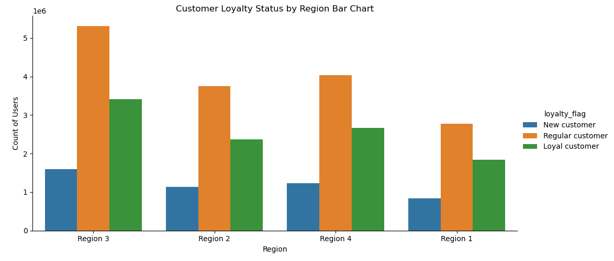

The box-and-whisker plot gauges the dispersion of total income within each age group, helping identify which age group possessed the most significant spending power. The senior age group (ages 62 and older) exhibited the highest total income, while young users (ages 35 and younger) had the lowest total income.

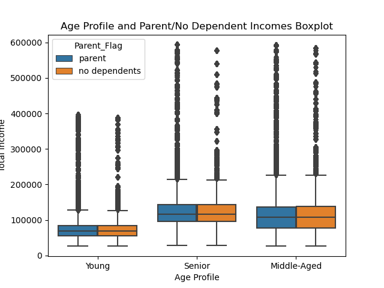

However, middle-aged parents are the largest segment within the customer demographic.

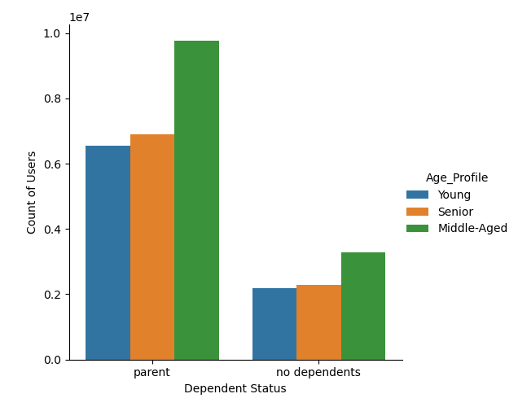

## Recommendations & Findings
* Increase advertising efforts during peak hours, specifically from 10am to 11am, on the slowest days of the week, which are Tuesdays and Wednesdays. This strategy can help maximize exposure during periods when user engagement is lower and may lead to increased sales on these days.

* Target advertising campaigns towards lower-priced products. The analysis revealed that low spenders (average item price of less than $10) tend to be the most loyal users (maximum order count greater than 40). Promoting affordable products caters to the preferences of this loyal customer segment and may boost sales among them.

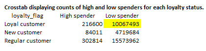

* Product promotions and advertising campaigns should feature items from the Produce, Dairy/Eggs, and Beverages departments. These departments consistently attract the highest demand from all user groups and regions.

* Most customers fall into the middle-aged, married, and parent demographic, it's advisable to design advertising strategies that resonate with this specific group. Married users also tend to have the highest proportion of high spenders, defined by an average item price of $10 or more. Marketing messages that cater to this demographic could lead to increased sales and customer satisfaction.

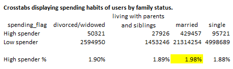

* Incorporate additional measures such as average price and length of membership to determine customer loyalty status.
 
## The Learning Experience
Learning a new programming language and effectively applying it represented a substantial learning curve throughout this project. To master Python, I engaged in thorough research and employed troubleshooting techniques, in addition to consulting my mentor for guidance. This was essential to comprehend the intricacies of Python and to achieve the desired results for my analysis.

In the process of crafting visualizations, I dedicated time to researching the Matplotlib and Seaborn libraries, focusing on understanding their syntax and functionality. This knowledge was pivotal in modifying and enhancing the quality of my visualizations.

As I continued to work on the project, I observed significant progress in my ability to write clean and well-documented Python scripts. With each iteration and practice session, I developed the skills required to efficiently resolve errors in my code and enhance the overall quality of my work.

## Datasets
* **The Instacart Online Grocery Shopping Dataset 2017** [Data set]. Accessed from www.instacart.com/datasets/grocery-shopping-2017 via Kaggle.
  https://drive.google.com/file/d/1hweDzLp0OC-tlFoZm_PBvp2gfH_xeU0v/view?usp=sharing
