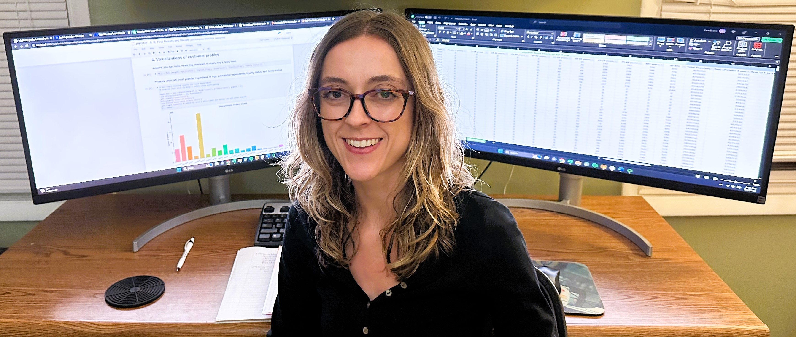
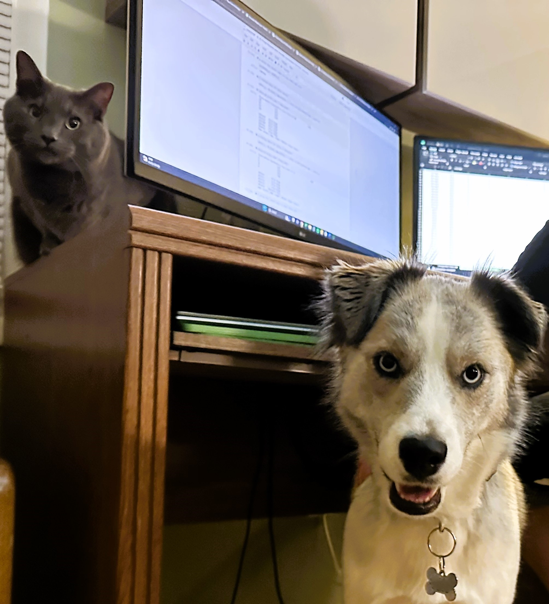

# About Me 
Hi there!👋 My name is Kara. I'm a **data analyst** with an interest in exploring science-related topics and troubleshooting tough problems. 

Over the past eight years, I have worked mostly in biomedical laboratories, where I handled patient data, interpreted results, and performed investigations. I decided to lean in to the analytical side of my science background with an education in data analytics to improve my investigative abilities. During this process I have bolstered my analytical skills with **statistical analyses** and **machine learning** methods using **Excel**, **SQL**, **Python**, and **Tableau**.

I'm a creative thinker, which I believe is a result of being a left-handed person living in a right-handed world. I like to develop my own solutions and go against the "norm" because the best answer usually isn't the obvious answer.

# Education
## Data Analytics Certificate | CareerFoundry
*Expected Completion: November 2023*

Online-based program concentrated on data analysis techniques using industry-standard tools. Topics include data quality measures & transformation, statistical hypothesis testing, and visualizations.

## Bachelor of Science, Biological Sciences | Ohio University
*Graduated 2014*

# Professional History 
## Senior Laboratory Technologist | November 2017-December 2022
* Performed investigations using critical thinking and root cause analysis techniques.
* Developed and improved procedures and job aids to enhance new-hire training material and reduce recurring workflow errors.
* Led and collaborated with small group to assess and present laboratory data to help shape company's strategic goals.

## Laboratory Technician | September 2015-November 2017
* Efficiently processed a high-volume of patient samples in a team-oriented setting.
* Applied effective decision making skills while troubleshooting sample-related issues.
* Communicated with hospital staff regarding patient samples in a timely manner.

## Analyst | August 2014-September 2015
* Analyzed test results using laboratory information management system.
* Monitored sample status in order to meet client-specific deadlines.

### For more details, check out my [resume](https://github.com/ke177409/Kara-Evans/blob/main/images/Evans.Kara%20Resume.pdf)! 
# Interested? 
## Send e-mails to **kara.e177409 at gmail dot com**
## Message and connect with me on [LinkedIn](https://www.linkedin.com/in/kara-m-evans/)!

### The Team (Ziggy & Roo): 

